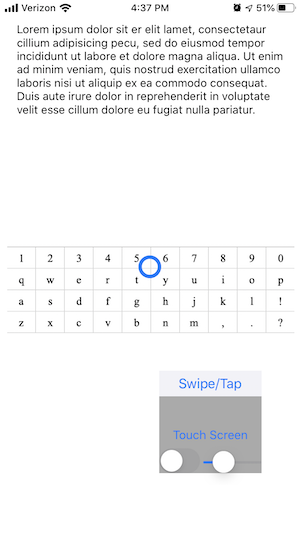

# ECE 209AS Human Computer Interaction
Zhao Lei, Yifei Chen

## Design
 - iOS & Swift
 - 2cm x 2cm interactive area
 - Traditional keyboard layout = Easy to learn & fast
 - Pan to move cursor, tap to insert, long press to capitalize
## Features
 - Caps lock/indicator
 - Adjustable speed for different use cases
 - Shortcut to backspace, space bar and enter
## Input Speed
We have achieved **10-15 words per minute** with this design
